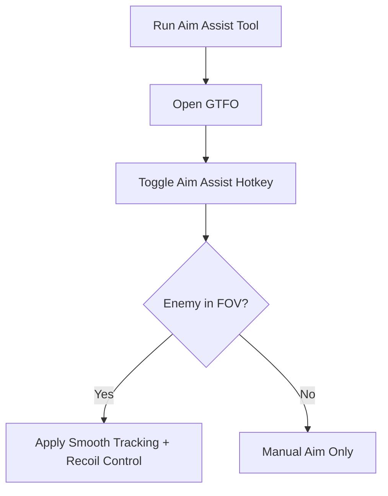

# GTFO Aim Assist 🎯

The **GTFO Aim Assist Trainer** is built for players who want to sharpen their aim and improve weapon control during the game’s intense survival scenarios. With **smooth tracking, customizable FOVs, and recoil adjustments**, this trainer helps you practice precision and combat efficiency in a safe, customizable environment.

---

## 📝 Overview

GTFO’s unforgiving enemies and low ammo economy mean every shot counts. Aim assist provides **natural aim guidance** that feels fluid instead of artificial, letting you focus on survival tactics, team coordination, and mission objectives without missing critical shots.

\[!IMPORTANT]
This trainer is meant for **offline practice and private testing sessions** only.


[](#)
[](#)
[](#)
[](#)


---

## ⭐ Features

* **Smooth Aim Tracking** – Adjust speed curves for natural targeting.
* **Customizable FOV** – Define lock radius for realistic precision.
* **Recoil Control** – Balance vertical and horizontal weapon kick.
* **Weapon Profiles** – Save configs for rifles, shotguns, or pistols.
* **Overlay Indicators** – Show FOV circle and active aim assist status.
* **Hotkey Toggles** – Enable/disable features instantly.

---

## 🖥 Compatibility

| Platform           | Supported | Notes                  |
| ------------------ | --------- | ---------------------- |
| Windows 10/11      | ✅         | Fully supported        |
| Steam              | ✅         | Stable trainer overlay |
| Linux (Proton)     | ⚠️        | Experimental use only  |
| Consoles (Xbox/PS) | ❌         | Not supported          |

\[!NOTE]
Accessibility: Visual overlays can be recolored, resized, and scaled for clarity in dark environments.

---

## ⚡ Setup Guide

1. **Download** the Aim Assist package.
2. Extract it into your GTFO installation directory.
3. Run `GTFO_AimAssist.exe` as administrator.
4. Launch GTFO and press `F2` to activate aim assist.
5. Adjust settings in the overlay menu or `config.ini`.

```ini
[aimassist]
fov=70
smooth=6
recoil_control=true
profile=rifle
hotkey=VK_XBUTTON2
```

---

## 🔄 Aim Assist Workflow



---

## ❓ FAQ

**Q: How is aim assist different from an aimbot?**
A: Aim assist provides natural, smooth tracking; it doesn’t snap instantly like an aimbot.

**Q: Can I create configs for multiple weapons?**
A: Yes, profiles let you store weapon-specific aim settings.

**Q: Will this impact performance?**
A: No, it’s lightweight and optimized for GTFO’s engine.

**Q: Can I disable recoil balancing?**
A: Yes, just set `recoil_control=false` in your config.

**Q: Does this affect save files?**
A: No, it operates in memory only.

---

## 🚀 Final Thoughts

The **GTFO Aim Assist Trainer** gives survivors a powerful way to **practice weapon control, sharpen aim, and reduce wasted shots**. With customizable configs, overlays, and lightweight performance, it’s the perfect practice companion for one of the toughest survival shooters.

---


